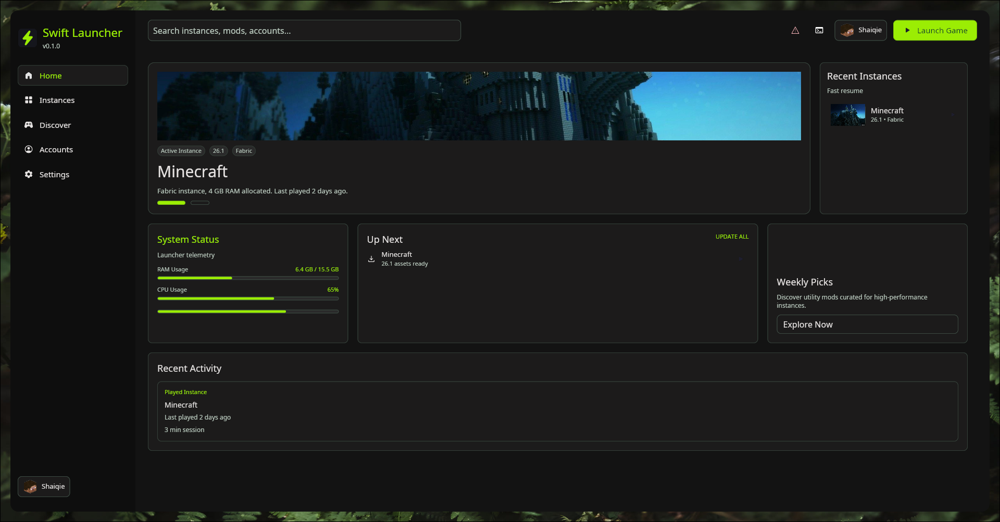

<div align="center">
  

  <h1>Swift Launcher</h1>

  <p>
    A Rust desktop Minecraft launcher for fast instance management, mod discovery,
    live launch diagnostics, and multi-provider authentication.
  </p>

  <p>
    
    
    
    
    
    
  </p>

  <p>
    
    
    
  </p>
</div>



## Overview

Swift Launcher is a native desktop launcher built around a high-density, dark interface for managing Minecraft instances and modded setups. It is written in Rust with Iced, uses asynchronous workers for downloads and launch preparation, and keeps the UI responsive while large asset checks, mod installs, and process logs run in the background.

The project is currently in active alpha. Core flows work, but packaging, provider edge cases, and full release hardening are still moving.

## Highlights

- Native Iced UI with hardware-accelerated rendering through `wgpu`.
- Instance dashboard with recent instances, system status, activity, and quick launch controls.
- Instance management with create, import, export, duplicate, delete, local files, logs, settings, worlds, and servers.
- Built-in discovery for Modrinth and CurseForge content.
- Resource install targets for mods, modpacks, resource packs, and shaders.
- Local mod management with enabled state, categories, dependency grouping, icons, and metadata dedupe.
- Modpack support for Modrinth `.mrpack`, CurseForge zips, and Prism/MultiMC imports.
- Authentication for Microsoft, Ely.by, and LittleSkin.
- Authlib Injector integration for Ely.by and LittleSkin launches.
- Managed Java detection/download plus custom Java path and JVM argument support.
- Live launch logs with severity coloring and crash report capture.
- World and server cards with quick play actions.
- Settings for Java, game directory, crash reporter, Discord Rich Presence, and CurseForge API key.

## Design Direction

Swift uses an "Obsidian Kinetic" desktop style:

- deep charcoal surfaces
- high-contrast typography
- compact navigation
- accent color from the Swift lightning mark
- dense layouts designed for repeated use, not marketing pages

The UI is optimized for desktop players managing multiple modded instances, not for a simplified mobile-like workflow.

## Tech Stack

| Area | Crates |
| --- | --- |
| UI | `iced`, `wgpu` through Iced, `image` |
| Async | `tokio` |
| Minecraft core | `lighty-core`, `lighty-version`, `lighty-auth` |
| Network | `reqwest` with `rustls-tls` |
| Storage | `sled`, TOML/JSON via `serde` |
| Integrity | `sha1`, `ring` |
| Archives | `zip`, `tar`, `flate2` |
| Diagnostics | `tracing`, `tracing-subscriber` |

## Supported Content

| Content type | Status |
| --- | --- |
| Vanilla instances | Supported |
| Fabric instances | Supported |
| Quilt instances | Supported |
| Forge / NeoForge instances | Present in UI, installer coverage still evolving |
| Modrinth mods | Supported |
| Modrinth modpacks | Supported |
| Modrinth resource packs | Supported |
| Modrinth shaders | Supported |
| CurseForge browsing/install | Supported with API key |
| CurseForge modpack import | Supported with API key |
| Prism / MultiMC import | Supported |
| Swift zip import/export | Supported |

## Authentication

Swift supports three account providers:

- Microsoft account device login
- Ely.by Yggdrasil login
- LittleSkin Yggdrasil login

Microsoft auth uses an Azure public-client app ID. New Microsoft Java Edition API integrations may require Mojang review/allowlisting. Ely.by and LittleSkin launches use Authlib Injector so game sessions resolve through the selected Yggdrasil provider.

## Requirements

- Rust stable toolchain
- Linux or Windows desktop environment
- A working GPU driver for Iced/wgpu rendering
- Network access for Minecraft metadata, assets, libraries, auth, and content providers
- Java can be auto-managed by the launcher, but a local Java install also works

## Build

```bash
cargo build
```

Release build:

```bash
cargo build --release
```

Windows cross-build from Linux:

```bash
cargo build --release --target x86_64-pc-windows-gnu
```

## Run

```bash
cargo run
```

Logging uses `tracing_subscriber` and honors `RUST_LOG`.

```bash
RUST_LOG=swift_launcher=debug,warn cargo run
```

Default log filter:

```text
swift_launcher=info,warn
```

## Test

```bash
cargo test
```

In restricted sandboxes, some tests need local sockets and writable temp directories. Run tests outside the sandbox if you see `PermissionDenied` or read-only filesystem errors from test servers/temp paths.

## Runtime Data

Swift stores launcher data in the platform application data directory:

| Platform | Directory |
| --- | --- |
| Linux | `~/.local/share/swift-launcher/` |
| Windows | `%APPDATA%\swift-launcher\` |
| macOS | `~/Library/Application Support/swift-launcher/` |

Common subdirectories:

- `instances/` for instance folders
- `libraries/` for shared Minecraft libraries
- `.swift/` inside instances for launcher metadata
- `swift-launcher.sled/` for account/settings/index storage

## Configuration

Most user-facing configuration is available from Settings. These environment variables are mainly useful for development, CI, or custom builds:

| Variable | Purpose |
| --- | --- |
| `SWIFT_LAUNCHER_MS_CLIENT_ID` | Override Microsoft Azure application client ID |
| `SWIFT_LAUNCHER_CURSEFORGE_API_KEY` | Bundle or inject CurseForge API key |
| `SWIFT_LAUNCHER_DISCORD_CLIENT_ID` | Enable Discord Rich Presence integration |
| `SWIFT_LAUNCHER_AUTHLIB_LATEST_URL` | Override Authlib Injector download URL |
| `SWIFT_LAUNCHER_MODRINTH_BASE` | Test/override Modrinth API base |
| `SWIFT_LAUNCHER_CURSEFORGE_BASE` | Test/override CurseForge API base |
| `SWIFT_LAUNCHER_ELYBY_BASE` | Test/override Ely.by auth base |
| `SWIFT_LAUNCHER_LITTLESKIN_BASE` | Test/override LittleSkin auth base |

CurseForge API keys can also be pasted directly in Settings. Players should not need shell exports for normal use.

## Project Layout

```text
src/
  main.rs                 Application entrypoint and Iced window setup
  app.rs                  Root state, update loop, subscriptions, async task wiring
  messages.rs             Message enum for UI and background events
  theme.rs                Shared theme, widget styles, color tokens
  screens/                Home, login, settings, loading, instance detail UI
  auth/                   Microsoft, Ely.by, LittleSkin session flows
  instances/              Instance CRUD, install, launch, mods, worlds, archives
  download/               Streaming download jobs and integrity checks
  storage/                Sled-backed account/settings persistence
  system.rs               System status sampling
assets/
  logo.svg
  preview.png
  icons/
  auth/
  images/
```

## Development Notes

- Do not block the Iced update loop. File I/O, network requests, installs, and launch prep should run through `Task`, `Subscription`, or Tokio workers.
- Keep persistent state in `storage/` and UI state in `SwiftLauncher`.
- Keep provider-specific logic inside `auth/`, `instances/mods.rs`, or `instances/archive.rs`.
- Prefer metadata-based resource dedupe over filename-only checks. Mod files often change names across provider versions.
- Run `cargo fmt`, `cargo test`, and `cargo clippy --all-targets -- -D warnings` before shipping changes.

## Current Limitations

- Forge and NeoForge support is not yet as complete as Fabric/Quilt.
- Discord Rich Presence IPC is currently Linux-focused.
- Microsoft Java Edition API access can depend on Mojang review of the Azure application ID.
- CurseForge modpack resolution requires an API key.
- The launcher is alpha software; expect provider edge cases while install and import logic matures.

## Legal

Swift Launcher is not affiliated with Microsoft, Mojang Studios, Modrinth, CurseForge, Ely.by, or LittleSkin. Minecraft assets, libraries, accounts, and services remain owned by their respective rights holders. Use this launcher in accordance with the Minecraft EULA, Microsoft account terms, and provider API terms.
